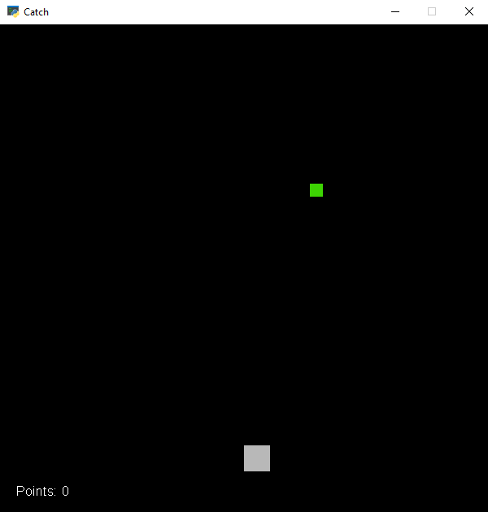

# Catch
 a game made with python

# Images

# Videos

making the game, videos:

[link to video: 1](https://youtu.be/QCMANOVsqPo)

showing the game, videos:

[link to video: 1](https://youtu.be/HTk5NZ2IVPw)

# How to install

1) make sure you got python(python 3)

2) click the clone button then click download zip file in github

3) wait for download then extract zip file

4) open the command line you use for installing librarys(open it inside the folder that has `requirements.txt`

5) then write in the command line this `pip3 install -r requirements.txt`

# How to play

1) run on `Main.py`

# Controls

Movment:

left = A

right = D

Pause:

pause = Space

# Note

if i say zip file i could be wrong becuase if your on differnt operating systems it might not be a zip file